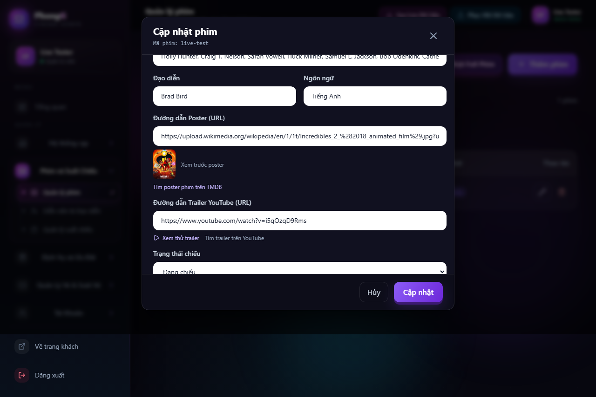
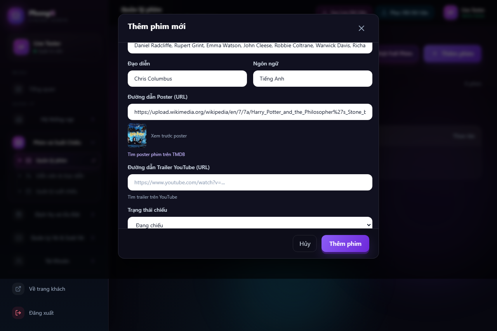
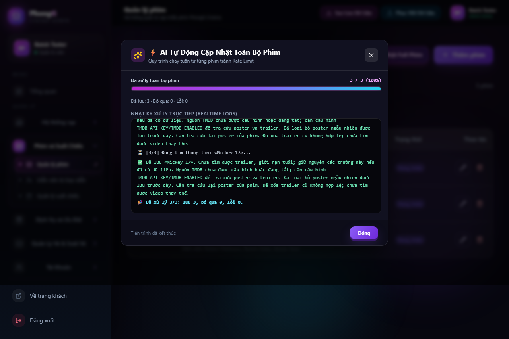

# Movie metadata lookup verification

Verified film: **The Incredibles 2 / Incredibles 2**.

The first real backend test failed. Wikipedia search was using `search=` instead of its required `srsearch=` parameter; the API returned an error inside HTTP 200, which was treated as an empty result. Correcting that parameter made the live test pass.

Changes also allow lookup to continue when TMDB suggestions are unavailable, accept the optional leading “The” in the film name, and extract runtime/director/cast from the film's Wikipedia infobox. For Pixar films, a trailer is accepted only after its YouTube metadata matches the film, is published by an allowed studio, and identifies it as a trailer. Unrelated recommendations and teaser trailers are excluded.

## Real-source results

- Runtime: **118 minutes**.
- Director: **Brad Bird**.
- Cast includes **Holly Hunter** and **Craig T. Nelson**.
- Poster: downloaded from Wikimedia; HTTP 200, image content type and image bytes verified by the backend, then loaded by the browser.
- Trailer: `https://www.youtube.com/watch?v=i5qOzqD9Rms`; discovered on the official Pixar film page and verified using YouTube's public oEmbed response.
- Browser: form fields filled correctly, poster loaded, trailer preview used the verified video ID, and the YouTube link matched that ID. Video playback itself is not asserted.
- Database writes: **none** during these tests.

The Java integration test calls real public sources with TMDB/Gemini disabled, then writes its response to `target/live-movie-result.json`. The browser test replays that fresh backend response through the form while loading the actual remote poster. TMDB suggestion failure is deliberately injected to verify fallback handling. This is a local-build verification, not a test of the deployed Render instance.



## Re-run

Start the built frontend preview on port 5174. In PowerShell:

```powershell
$env:MOVIE_LOOKUP_LIVE = 'true'
.\mvnw.cmd -Dtest=LiveMovieLookupTest test
$env:QLBVXP_E2E_BASE_URL = 'http://127.0.0.1:5174'
npx.cmd playwright test tests/movie-ai-live.spec.ts --workers=1 --reporter=line
```

The normal regression suite uses `MovieCrawlServiceTest`, `TmdbMovieServiceTest`, `GeminiMovieServiceTest`, `MovieMediaUpdateTest`, `MovieAiLookupControllerTest`, `ExternalHttpConfigTest`, and `tests/movie-ai.spec.ts`.

## Harry Potter franchise fallback

Verified the exact input `harry potter` with TMDB disabled: Wikipedia returned **8 individual films**. The series overview and character/book pages are excluded. Selecting **Harry Potter and the Philosopher's Stone** returned **152 minutes**, **Chris Columbus**, the fantasy genre and a poster that downloaded with HTTP 200. The browser displayed the 8 choices, filled the selected film's fields and loaded its real remote poster.

Each choice includes a `source` field. Wikipedia page IDs are not forwarded to TMDB as movie IDs. Both frontend and backend need this version when deploying the new fallback choices.



## Batch update regression (2026-10-07)

The reported batch failure came from existing YouTube **search URLs** being preserved and submitted to the backend's video URL validator. The batch payload now clears invalid old media, accepts valid video links, preserves useful existing fields and sends only supported update fields. Missing media does not prevent saving other verified metadata. A missing trailer stays empty; no search link is saved as a video.

The batch loads every page before writing, prevents duplicate starts, counts saved/skipped/failed films separately and continues after individual failures. Stopping cancels metadata reads and delays. An already running save is allowed to finish so its outcome can be counted; no next film starts. Stopping no longer produces a completion message.

Real public-source checks with TMDB and Gemini disabled passed for the three films in the screenshot:

| Film | Runtime | Director | Poster |
| --- | --- | --- | --- |
| Mission: Impossible - The Final Reckoning | 170 minutes | Christopher McQuarrie | HTTP 200, image content type and bytes |
| Snow White (2025) | 109 minutes | Marc Webb | HTTP 200, image content type and bytes |
| Mickey 17 | 137 minutes | Bong Joon Ho | HTTP 200, image content type and bytes |

Mickey 17 exposed an additional bug: a Vietnamese page with a poster prevented the English infobox from supplying missing fields. Missing runtime/director/cast/language now also trigger supplementation.

Verification: 9 Node batch tests (including 300 movies across pages and both successful/failed in-flight saves after stopping), 12 browser form/batch tests, 2 browser tests loading actual Harry Potter/Incredibles posters, and 41 backend regression tests. Backend packaging and frontend production build passed. The three-film browser batch uses metadata freshly captured from the real backend lookup, with isolated fixture saves. **No production database writes occurred; the production catalog of 111 films was not updated or individually verified.**

The first live reruns hit an upstream timeout. Public-source checks then passed with a 30-second integration-test timeout and IPv4 preference; production connection settings were not changed. Re-run the public checks with:

```powershell
$env:MOVIE_LOOKUP_LIVE = 'true'
.\mvnw.cmd -Dtest=LiveMovieLookupTest -Dapp.http.metadata-timeout-ms=30000 -Djava.net.preferIPv4Stack=true test
$env:QLBVXP_E2E_BASE_URL = 'http://127.0.0.1:5174'
npx.cmd playwright test tests/movie-ai.spec.ts tests/movie-ai-batch.spec.ts tests/movie-ai-live.spec.ts --workers=1 --reporter=line
node --test tests/dongBoPhimAi.node.mjs
```


